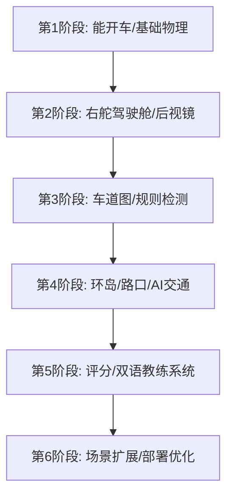

# UK Driving Trainer - AI Agent 协作开发计划

本项目定位为**“英国新手驾驶训练模拟器”**（非赛车游戏）。核心目标是通过 Web 端 3D 模拟，让用户在安全的环境中反复练习英国的驾驶规则（右舵视角、靠左行驶、环岛、让行、限速、打灯、观察盲区、行人优先、窄路会车、停车入位）。

本文件为项目的主开发计划，定义了整体路线图、Agent 角色职责、协作流以及断点续接机制，确保后续 AI Agent 可以无缝续接并高效执行开发。

---

## 一、项目理解与目标确认

### 1. 现有代码结构与状态
* **当前状态**：空项目（Greenfield），仅包含 `需求.txt` 需求说明书。
* **现有资源**：英国 Highway Code 规则定义、Mirrors-Signal-Manoeuvre (MSM) 及 Position-Speed-Look (PSL) 教学概念。

### 2. 最终目标 (MVP Demo 场景)
* **场景**：包含住宅区、Give Way 路口、小环岛 (Mini-roundabout)、斑马线 (Zebra Crossing) 及 Tesco 风格停车场的 3D 小镇。
* **操作**：键盘/手柄控制车辆（W/S/A/D、Q/E转向灯、R档、空格手刹、鼠标/Shift转头观察）。
* **核心反馈**：右舵驾驶舱视角（带后视镜/侧视镜）、HUD 实时教练提示系统（中英双语）、扣分与结算面板。
* **技术选型**：`Three.js (WebGLRenderer.setAnimationLoop)` + `TypeScript` + `Vite` + `Rapier 物理引擎`。

### 3. 技术路线与开发优先级
1. **P0 (核心基础)**：车辆物理控制与驾驶舱视角（右舵）。
2. **P1 (道路与导航)**：路网结构 (RoadGraph) 与车道线、限速牌、Give Way 线的检测。
3. **P2 (规则与评分)**：扣分引擎与教练提示（环岛让行、靠左行驶、打灯检测）。
4. **P3 (场景与 AI)**：NPC 车辆和行人 AI、6 个核心教学关卡、Tesco 停车场。

---

## 二、整体开发计划与路线图



### 阶段划分与验收标准

| 阶段 | 目标 | 输入 | 输出 | 验收标准 | 串/并行关系 |
| :--- | :--- | :--- | :--- | :--- | :--- |
| **Stage 1: 基础底盘** | 车辆在 3D 地面上可进行前进、后退、转向、刹车等物理移动。 | 物理参数、Vite 工程模板 | 车辆底盘物理控制器、基础 3D 渲染场景。 | 车辆可在键盘控制下平稳行驶，无穿模或侧翻。 | **串行**（必须最先完成） |
| **Stage 2: 驾驶舱** | 实现第一人称右舵驾驶视角，仪表盘 (mph) 及后视镜反射。 | Stage 1 输出、座舱模型/UI | 车内视角、左右后视镜组件、转向灯 Tick 声音。 | 方向盘位于右侧，速度以 mph 显示，三镜能实时渲染后方画面。 | **串行** (依赖 Stage 1) |
| **Stage 3: 道路路网** | 构建路网拓扑，可判定车辆在哪个车道、是否超速或逆行。 | RoadGraph 结构、车辆姿态与速度状态 | 道路编辑器/解析器、靠左检测算法、限速检测器。 | 车辆偏离车道或超速时，后台能准确打印警告数据。 | **拆分并行**：RoadGraph 类型与 Schema 可与 Stage 2 并行；车道检测接入依赖 Stage 2 的车辆/相机状态输出。 |
| **Stage 4: 环岛与路口** | 实现 T 字路口及环岛判定逻辑，加入 NPC 车辆。 | Stage 3 输出、AI 寻路 | Give Way 检测器、环岛进出判定器、简易 NPC 车流。 | 玩家在环岛不让右侧车或出环岛不打左灯时可被精准捕获。 | **串行** (依赖 Stage 3) |
| **Stage 5: 评分教练** | 将规则转换为扣分与实时提示 HUD，提供结算复盘。 | Stage 4 输出、双语提示文本 | RuleEngine 扣分系统、实时教练面板、结果结算 UI。 | 模拟跑完一圈后，展示扣分明细及中英文改进建议。 | **并行** (可与 Stage 4 并行开发) |
| **Stage 6: 场景扩展** | 完善 6 大关卡，加入斑马线行人、超车道，打包上线。 | Stage 5 成果、美术资源 | Tesco 停车场、斑马线行人 AI、Vite 生产包。 | 500米完整 Demo 链路顺畅，性能稳定 60 FPS。 | **串行** (最终收尾) |

---

## 三、AI Agent 角色拆分

为保证开发的可扩展性，项目拆分为 10 个 Agent：

1. **Product Manager (PM) Agent**：负责关卡设计、评分细则、教练话术、用户流程。
2. **Tech Lead / Architect Agent**：负责 RoadGraph 数据结构设计、物理引擎选型、模块接口。
3. **Frontend Agent**：负责 Three.js 场景渲染、仪表盘 UI、后视镜 Shader、结算界面。
4. **Backend Agent**：负责本地持久化（关卡解锁、历史高分）、配置加载（RoadGraph JSON）。
5. **UI/UX Agent**：负责 Low-poly 风格色彩规范、HUD 仪表盘排版、操作指引交互。
6. **QA / Testing Agent**：负责物理引擎边界测试、规则引擎单元测试、自动化行车路径测试。
7. **DevOps / Deployment Agent**：负责 Vite 编译配置、静态文件压缩、GitHub Actions CI/CD。
8. **Security Agent**：负责输入防抖、运行时安全边界、Web 性能防挂起、帧率同步检测与本地存档完整性校验。
9. **Documentation Agent**：负责 API 设计文档、RoadGraph 配置说明、Highway Code 对应表。
10. **Coordinator Agent**：负责协调所有 Agent 的进度，管理 `/status/` 断点续接文件。

---

## 四、项目目录结构

```text
/
├── .github/                # CI/CD 自动化构建
├── agents/                 # [NEW] AI Agent 初始化配置文件
├── tasks/                  # [NEW] AI Agent 任务跟踪文件
├── status/                 # [NEW] 断点续接状态管理文件
├── docs/                   # 项目设计与 Highway Code 规则库
├── public/                 # 静态资源（模型、声音、字体）
├── src/
│   ├── main.ts             # 入口文件
│   ├── core/               # 核心引擎 (Game, Time, Input, Camera)
│   ├── vehicle/            # 车辆物理与舱内视角 (PlayerCar, Physics, Mirrors)
│   ├── road/               # 路网系统 (RoadGraph, Lane, Roundabout)
│   ├── traffic/            # 交通 AI (TrafficAI, PedestrianAI)
│   ├── rules/              # 规则扣分引擎 (RuleEngine, SpeedLimit, GiveWay)
│   ├── training/           # 关卡设计 (Scenario, Scoring, Instructor)
│   ├── ui/                 # 2D overlays (HUD, Minimap, Results)
│   └── data/               # 关卡及路网 JSON 配置文件
├── tests/                  # 单元测试与物理仿真测试
├── vite.config.ts          # Vite 构建配置
└── package.json            # 依赖管理
```

---

## 五、开发规范

### 1. 代码风格与命名
* 使用 **TypeScript**，严格类型约束 (`noImplicitAny: true`)。
* 类名使用 `PascalCase`，方法与变量使用 `camelCase`，静态常量使用 `UPPER_SNAKE_CASE`。
* 物理坐标系统一：Y 轴向上，X/Z 轴为地面。速度单位统一使用 `mph`，内部计算可使用 `m/s` 但须清晰标注。

### 2. Git & Commit 规范
* 主分支为 `main`，开发分支为 `feature/xxx`。
* Commit 提交规范采用 Angular 规范：`<type>(<scope>): <subject>`。
  * `feat`: 新增功能
  * `fix`: 修复 Bug
  * `docs`: 文档变更
  * `style`: 样式调整
  * `refactor`: 重构代码

### 3. 错误处理与日志
* Three.js 动画循环内部禁止抛出未捕获异常。所有物理更新、规则判定需包裹在 `try-catch` 中，异常需记录并降级处理，避免画面卡死。
* 日志级别分明：调试信息使用 `console.debug`，业务状态变化使用 `console.log`，非致命报警使用 `console.warn`。

---

## 六、AI Agent 执行规则与断点续接

所有协作 Agent 必须无条件遵守以下规则，确保开发的可持续性：

1. **上下文优先**：在未读取 `/status/CURRENT_CONTEXT.md` 和对应任务文件前，禁止修改任何代码。
2. **小步快跑**：每次修改文件的行数建议控制在 100 行以内，严禁“一次性重构整个模块”。
3. **副作用隔离**：修改物理或渲染逻辑前，必须确保不影响规则引擎的输入数据流。
4. **文件所有权优先**：修改共享文件前，必须检查 `docs/coordinator/agent_contracts.md` 的文件所有权表；非 Owner Agent 只能追加约定范围内的内容，或先在任务/状态文件中登记协调需求。
5. **状态更新机制**：
   * **开始工作前**：读取 `/status/PROJECT_STATUS.md` 确认全局状态。
   * **任务推进时**：在 `/tasks/[agent-name]-tasks.md` 中将任务标记为 `IN_PROGRESS`。
   * **任务完成后**：更新任务状态为 `DONE` 或 `NEED_REVIEW`，同时在 `/status/PROGRESS_LOG.md` 中追加一条包含日期、修改人、修改文件、解决问题和下一步建议的日志。
   * **遇到阻塞时**：将问题记录至 `/status/BLOCKERS.md`，并将任务状态标为 `BLOCKED`，等待 Coordinator 协调。
6. **教练提示优先**：凡是涉及英国驾驶规则的代码修改，必须在 `docs/requirements/rules_mapping.md` 中关联到具体的 Highway Code 条款。
