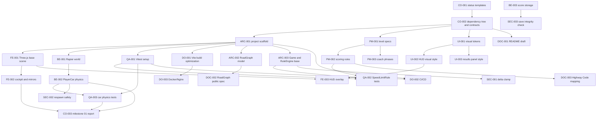

# Agent Task Dependency Tree

This dependency tree resolves the first development iteration and identifies safe parallel work.

---

## Mermaid View

---

## Execution Notes

* `CO-001` and `CO-002` are complete.
* `ARC-001` and `PM-001` are both HIGH priority and parallel-safe.
* `UI-001` is parallel-safe as long as it only creates visual tokens and does not wire runtime HUD state.
* `DOC-001` may begin as a draft, but command examples must be rechecked after `ARC-001`.
* `ARC-002` owns the technical model notes; `DOC-002` owns the public RoadGraph spec.
* No deadlock is present in the first-iteration graph.

